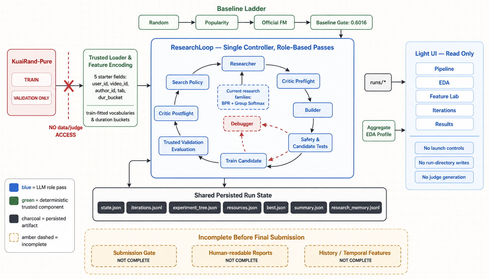

# Senior Prompt Engineers — TechJam 2026

TechJam 2026 Track 2 — Autonomous Machine Learning Research Agent for Recommender Systems.

## Project overview

An autonomous ML research agent for **KuaiRand-Pure**. Given the dataset and the organizers'
metrics, it runs the full MLE loop of the problem statement's Figure 1 on its own — read the
problem, inspect the data, engineer features, train and tune, evaluate, then reflect and
iterate — and writes the code for each stage itself rather than selecting from prepared
implementations.

The task is fixed by the organizers and this repository does not change it: rank within each
user's logged impressions, with `long_view` as the positive label, scored by
**GAUC / nDCG@5** and `primary = mean(GAUC, nDCG@5)`. Development uses the train and
validation splits only; the hidden test split is never read during a run
(`src/evaluation/official.py` filters on date *before* touching the label column).

How it works, end to end:

1. **Baseline first.** The agent reproduces the organizers' reference pipeline — a numpy
   factorization machine — and refuses to proceed on a baseline that does not match the
   published validation score, so every later delta is measured against the real reference
   rather than something the agent built for itself.
2. **Four roles per iteration.** An EDA pass, then Researcher (proposes one controlled
   experiment, citing a method card), Critic (approves or rejects before any compute is
   spent), Builder (writes `candidate.py` and its unit tests) and Debugger (repairs a failed
   candidate, bounded).
3. **Generated code runs sandboxed.** Candidate source is AST-validated and executed with a
   restricted `__builtins__`, an import allowlist and no filesystem, network or subprocess
   access, so an LLM-written candidate cannot reach the raw logs or the evaluator.
4. **Trusted code owns the numbers.** Metrics, checkpoints and the submission are computed by
   the harness, never reported by the candidate.
5. **It stops on the organizers' rule.** ε = 0.002 over N = 3 iterations, with the
   50-iteration and 6-hour caps as backstops.

Four research families are registered, each with a method card the Researcher must cite:
`bpr`, `group_softmax`, `history_features` (user-behaviour history, the starter kit's #2
untested direction) and `multi_task` (auxiliary feedback signals, its #3).

## Results

The committed converged run is [`runs/final/`](runs/final/); its full ledger, per-iteration
diffs, data card and submission are in the repository.

| Metric | Official baseline | Agent best | Δ |
|---|---|---|---|
| GAUC | 0.6674 | 0.6707 | +0.0033 |
| nDCG@5 | 0.5357 | 0.5382 | +0.0025 |
| **primary** | **0.6016** | **0.6045** | **+0.0029** |

Best candidate `hist_prior_days_var_gs2_3b9a_seed1` — a `history_features` proposal, i.e. the
agent's own gain came from the feature axis rather than from tuning the loss. Stop reason
`converged`, submission gate `ok`, 170,588 scored rows.

Resource usage to reach that result (Feasibility reporting):

| | |
|---|---|
| LLM tokens (input + output) | 446,210 |
| Agent wall-clock | 29.5 min |
| GPU-hours | 0.0 |
| Iterations used | 6 of 50 (stopped on the convergence rule, not the cap) |
| **Manual interventions** | **0** |

Read the delta against the attainable range, not against 1.0: a perfect ranking scores
**primary 0.8645** on the hidden test — 27.1% of users have no positive label and score nDCG 0
for any model — and random scoring sits at 0.4753. The baseline already captures ~31% of that
span. See *Limitations* for how much of this delta is separable from seed noise.

## Reproduce the results

```bash
# 1. environment
python -m venv .venv && .venv/Scripts/activate      # Linux/macOS: source .venv/bin/activate
python -m pip install -r requirements.txt

# 2. dataset (~280 MB, verified by checksum; never committed)
sh scripts/download_data.sh

# 3. tests
python -m pytest -q

# 4. reproduce the official baseline (~40 s of FM training)
python -m src.agent.controller --config configs/baseline.json

# 5. reproduce the autonomous run: put your provider key in .env, then
python -m src.agent.controller --config configs/ranking_losses.json
```

Step 5 is a live LLM run and consumes API credit. For an offline end-to-end check that needs
no key and no credit, use the scripted provider:

```bash
python -m src.agent.controller --config configs/offline_smoke.json
```

Each run writes a timestamped directory under `runs/` containing `journal.md` (hypothesis and
code diff per iteration), `results.md` (results table, token usage, wall-clock, intervention
count), `iterations.jsonl`, `DATA_CARD.md` and `submission.csv`. An autonomous run is
stochastic — the LLM proposes different experiments each time — so a fresh run will not
reproduce `runs/final/` candidate for candidate; the baseline in step 4 is deterministic and
does reproduce exactly.

## What is implemented

The repository provides an end-to-end autonomous research harness:

- a deterministic experiment proposer with an interface that can later be backed
  by an LLM
- an isolated subprocess runner with timeouts and failure capture
- train/validation-only data loading that skips test dates before reading labels
- the untouched starter-kit evaluator and FM implementation
- random, item-popularity, and official-FM validation baselines
- JSONL iteration logs, best-checkpoint tracking, reflection, convergence, and
  global budget enforcement
- a single role-based autonomous research loop using Researcher, Critic, Builder,
  and Debugger passes over shared persisted memory
- OpenAI Responses API and OpenAI-compatible Chat Completions adapters, including
  GLM, with structured outputs, retry handling, and token accounting
- restricted agent-generated candidates with trusted metric computation
- BPR and same-user group-softmax research cards and audited sampling utilities
- coarse live-stage observability, structured agent decision notes, and immutable
  per-iteration candidate patches for the local dashboard

## Setup

Python 3.9+, NumPy, and the OpenAI Python SDK are required. POSIX:

```bash
python -m venv .venv
source .venv/bin/activate
python -m pip install -r requirements.txt
bash scripts/download_data.sh
```

PowerShell (download the dataset with Git Bash or WSL first):

```powershell
python -m venv .venv
.\.venv\Scripts\Activate.ps1
python -m pip install -r requirements.txt
```

Place the extracted KuaiRand-Pure files under:

```text
data/KuaiRand-Pure/data/
```

Development uses only the official train/validation dates. The final gate loads
label-free test metadata, scores the validation-selected checkpoint once, and
never exposes test labels to model selection.

## Run the baseline agent

From the repository root:

```bash
python -m src.agent.controller --config configs/baseline.json
```

```powershell
python -m src.agent.controller --config configs/baseline.json
```

This command remains fully deterministic and does not require an API key.

The baseline ladder should be approximately:

| Experiment | Validation primary |
|---|---:|
| Random | 0.4834 |
| Item popularity | 0.5807 |
| Official FM | 0.6016 |

Each run creates `runs/<run-id>/` containing:

- `run_config.json` — frozen configuration
- `source_manifest.json` — SHA-256 revision of every project-owned source file
- `iterations.jsonl` — hypotheses, configurations, metrics, failures, recoveries,
  intervention counts, and reflections
- `best.json` — validation-best experiment and checkpoint
- `summary.json` — stop reason, resource use, and final result
- `stdout/` and `artifacts/` — generated logs and checkpoints

## Tests

```bash
python -m pytest -q -W error
python -m unittest discover -s tests -v
```

```powershell
python -m pytest -q -W error
python -m unittest discover -s tests -v
```

The test suite uses a scripted provider and does not make paid API calls.

## Run the autonomous ranking-loss researcher

Create your local environment file from the committed template, then add your
API key to `.env`:

```bash
cp .env.example .env
# Edit .env and set OPENAI_API_KEY, then run:
python -m src.agent.controller --config configs/ranking_losses.json
```

```powershell
Copy-Item .env.example .env
# Edit .env and set OPENAI_API_KEY, then run:
python -m src.agent.controller --config configs/ranking_losses.json
```

`.env` is loaded automatically and ignored by Git. An `OPENAI_API_KEY` already
set in PowerShell or CI takes precedence over the file.

The research run uses `gpt-5.4-nano` with low reasoning and low verbosity by
default. Edit `configs/ranking_losses.json` to use a model available to your
OpenAI project. Full benchmark configs use the official 50-iteration and
six-hour caps. Per-iteration execution is capped at 432 seconds so 50 iterations
sum to six hours. LLM tokens, training attempts, GPU-hours, and proposal counts
are recorded for feasibility and debugging; they are not official benchmark stop
conditions unless a config explicitly sets an engineering guard.

### Use GLM or another OpenAI-compatible endpoint

GLM uses an OpenAI-compatible **Chat Completions** endpoint rather than the
Responses API used by the default GPT configuration. A ready-to-edit GLM config
is provided at `configs/ranking_losses_glm.json`:

```bash
# Put the provider key in .env; never put it in the JSON config.
ZAI_API_KEY=your-provider-key
python -m src.agent.controller --config configs/ranking_losses_glm.json
```

The adapter also accepts `provider: "openai_compatible"` for other compatible
services. Configure `model` plus either `base_url`/`endpoint` in JSON or
`OPENAI_MODEL` plus `OPENAI_BASE_URL` in the environment. The API-key variable is
selected by `api_key_env` and defaults to `OPENAI_API_KEY`, so a generic setup can
look like:

```json
{
  "llm": {
    "provider": "openai_compatible",
    "model": "your-model-name",
    "api_key_env": "OPENAI_API_KEY",
    "endpoint": "https://provider.example/v1/chat/completions"
  }
}
```

The key must be issued by the service behind that endpoint; an OpenAI-issued key
does not authenticate to GLM. Provider-specific reasoning and search are opt-in
through `thinking` and `web_search_tool`. If the endpoint does not implement
those extensions, omit them. JSON responses are validated locally against the
same role schemas used by the GPT path. The example uses Z.AI's global API URL;
accounts on the mainland China platform should replace it with the base URL shown
for their account.

The run first reuses a passing official-FM run; if none exists it automatically
reproduces the baseline gate. A promising family is now given a short controlled
follow-up window before broad exploration, and a failed or clearly regressed new
family falls back to the current validation-best family. Family coverage is
reported for auditability, but it is not a hard lock that overrides attribution
of the best lead. An improvement greater than `0.002` queues exact seed-1 and
seed-2 replications.

Resume an interrupted research run with:

```bash
python -m src.agent.controller \
  --config configs/ranking_losses.json \
  --resume runs/<research-run-id>
```

```powershell
python -m src.agent.controller `
  --config configs/ranking_losses.json `
  --resume runs/<research-run-id>
```

There is not yet an `intervene` CLI. Operator actions must be recorded manually;
adding an append-only intervention command and derived counter is listed below as
a limitation.

## Run the frontend research dashboard

For the complete two-terminal UI and live-agent walkthrough, see
[`docs/UI_QUICKSTART.md`](docs/UI_QUICKSTART.md).

Install the optional UI dependencies:

```bash
python -m pip install -r requirements-ui.txt
```

Then launch the dashboard from the repository root:

```bash
python -m streamlit run streamlit_app.py
```

OR Launching the nested file directly is also supported:

```bash
python -m streamlit run src/ui/app.py
```

The Pipeline tab refreshes every five seconds only for a running research run.
Its translucent execution overlay shows the active coarse stage, elapsed time,
structured Agent Notes, finalized candidate changes, errors/repairs, and the
recent transition timeline. It does not stream raw reasoning or full prompts.

The dashboard is read-only: it cannot launch, resume, cancel, reconfigure, or
authorize a run. It discovers artifacts under `runs/`, reads the explicit
aggregate EDA profile under `artifacts/ui/`, and rejects judge-owned paths. Its
CSV uploader performs local schema/finiteness checks only; judge row alignment
is truthfully reported as unchecked.
### Run the offline smoke test

For a complete end-to-end test of the real training subprocess without an API
key or network access, run:

```bash
python -m src.agent.controller --config configs/offline_smoke.json
```

```powershell
python -m src.agent.controller --config configs/offline_smoke.json
```

This test uses a scripted LLM provider and fixed mock decisions. It runs exactly
one iteration with the BPR candidate, trains on real data, evaluates on the
validation set, and exits. Expected validation primary score is approximately
`0.602`. This configuration confirms that the full generate→train→evaluate path
works end-to-end before depending on live LLM calls.

### Generated candidate contract

The Builder writes only under `generated_experiments/<run-id>/<iteration>/`.
Candidate code defines:

```python
def run(context, parameters) -> CandidateOutput:
    ...
```

Candidates receive encoded train features/labels, label-free validation/test
features, and a trusted validation callback. They return validation and test scores,
checkpoint arrays, a training trace, and diagnostics. The trusted worker checks
shape and finiteness and computes final GAUC/nDCG@5 itself; candidate-reported
metric values are ignored.

### Research audit files

Research runs add:

- `state.json` — atomic resumable state
- `experiment_tree.json` — branch, family, parameters, outcome, and parent
- `research_memory.jsonl` — role-call records and recovery events
- `resources.json` — time, tokens, iterations, interventions, and GPU-hours
- `passes/` — structured prompts and outputs for each role
- `interventions.json` — explicit human-intervention ledger
- `activity.json` — atomic snapshot of the latest coarse stage transition
- `activity.jsonl` — append-only live-stage transition timeline
- `changes/` — per-iteration file/line summaries and reproducible candidate patches

Generated source is statically checked before writing/execution. Judge paths,
official evaluator imports, file/network/process access, dynamic execution, path
traversal, and non-approved imports are rejected. Candidate unit tests run before
training, and the Debugger gets at most two hypothesis-preserving repairs.

## Iteration, Training, and Convergence Definitions

The research loop tracks three distinct counts:

**Iteration** (`max_iterations`, cap 50)
: One scored candidate experiment. The loop increments the iteration count once a candidate has run to completion and been evaluated on validation data. Stop reason `candidate_budget_reached` fires when iteration count reaches `max_iterations`.

**Training attempt** (`max_training_attempts`, optional engineering guard)
: One executor subprocess call to train a candidate model. Repairs may create
multiple attempts for one candidate. By default this is telemetry only; if a
config explicitly sets `max_training_attempts`, `training_attempt_budget_reached`
fires at that engineering guard.

**Proposal** (`max_proposals`, default `max_iterations × 2`)
: One research→build cycle, including rejected candidates. The Critic may reject a candidate's preflight check; rejected proposals increment the proposal counter but do not run training. Stop reason `proposal_budget_reached` fires when proposal count reaches `max_proposals`.

**Convergence** uses ε = **0.002** and patience **3** over successful validation
scores only. Failed experiments do not count as convergence evidence because
they have no validation score. Every successful scored iteration, including an
exact seed replication, enters the official running-best sequence. Once the rule
fires it is terminal: queued replications or follow-ups cannot keep the run alive.
Meaningful improvements queue seed-1 and seed-2 replications immediately so that
variance evidence is collected before, rather than after, convergence.

Research proposals and outcomes are also persisted across runs in
`research/discoveries/discoveries.json`, regardless of whether web search was
used. The next run receives a bounded summary containing hypotheses, parameters,
metrics or failure lessons, and run/iteration provenance. Web citations remain
attached when available but are not required for an experiment to become memory.

## First research agenda

The approved method catalog currently contains pairwise BPR, same-user
group-softmax, leakage-safe history features, and multi-task auxiliary feedback.
The Researcher chooses the order and parameters, the Critic checks evidence and
leakage, and the Builder generates each implementation. The deterministic policy
uses a controller-owned, three-parent beam rather than allowing the model to
expand arbitrary DAG nodes. Parents must be successful. The frontier is ranked
by cost-aware expected improvement, uncertainty, novelty, failure risk, and
observed runtime. Most proposal slots deliberately target an underexplored
non-best family, while three slots per ten exploit the current lead. Parent
selection is constrained to the chosen family when that family has a viable
frontier node. Two family failures,
two mechanism-level critic rejections, or two stagnant children close a branch.
Exact and near-duplicate proposals are rejected before code generation or
training. Optional low-fidelity epoch screening is configured under
`research.search.low_fidelity` and remains disabled until its promotion threshold
has been calibrated on validation-only development runs.

## Baseline reproduction

The committed final run pins the official baseline through its gate:
[`runs/final/baseline_gate.json`](runs/final/baseline_gate.json) records the
official FM validation baseline primary **0.6016** (published GAUC 0.6674 /
nDCG@5 0.5357) that every iteration is scored against. A local end-to-end
retrain of the untouched starter-kit FM reproduces it within noise (best-epoch
validation primary 0.6015). Ladder runs write only gitignored stdout and
checkpoints, so the pinned gate record above is the committed baseline
evidence.

## Final submission run (committed)

The designated final run is committed at [`runs/final/`](runs/final/) — a copy of
run `20260831T141845874517Z_research` with local absolute paths rewritten to
repo-relative form for publication; provenance paths inside its JSON records
still reference that original run id. Model checkpoints (`artifacts/`, `*.npz`)
are deliberately excluded; everything else ships: the full iteration ledger,
per-role prompts and outputs, candidate patches, stdout, rendered reports, and
the submission CSV. The agent-generated code for every iteration is committed at
[`generated_experiments/final/`](generated_experiments/final/).

The run completed with `stop_reason: converged` at **iteration 6 of 50** under
the official ε = 0.002, patience-3 rule — before the 50-iteration and six-hour
limits. It was driven by `deepseek-v4-flash` on an OpenAI-compatible endpoint
(frozen in [`runs/final/run_config.json`](runs/final/run_config.json)).
Recorded resource use: **446,210 LLM tokens** (311,696 input / 134,514
output / 230,144 cached), **1,772 s (0.49 h) wall-clock**, 8 training attempts,
7 proposal attempts, **0 GPU-hours**, and **0 manual interventions**
([`resources.json`](runs/final/resources.json)).

| Iteration | Candidate | Family | Status | Primary |
|---:|---|---|---|---:|
| 1 | `bpr_topweighted_hard_2` | bpr | success | 0.5550 |
| 2 | `gs_hist_cross_hard_temp1` | group_softmax | success | 0.5528 |
| 3 | `hist_prior_days_var_gs2_3b9a` | history_features | success | 0.6038 |
| 4 | `hist_prior_days_var_gs2_3b9a_seed1` | history_features | success (seed replication) | **0.6045** |
| 5 | `hist_prior_days_var_gs2_3b9a_seed2` | history_features | success (seed replication) | 0.6036 |
| 6 | `mt_click_aux_02_bpr` | multi_task | success — third stagnant success; convergence latched | 0.5820 |

Iterations 1–2 landed far below the FM baseline; the loop then found the
prior-days history-feature family — its candidates use the split-specific
feature specs pinned by the new `history_features` Builder contract —
replicated it across two more seeds, and converged. The first proposal of
iteration 1 was reworked in-iteration before any code ran (`results.md`:
0 failed iterations, 0 rejected before code).

Validation results against the official baseline (GAUC 0.6674 / nDCG@5 0.5357 /
primary 0.6016):

| Checkpoint | GAUC | nDCG@5 | Primary | Δ primary |
|---|---:|---:|---:|---:|
| Best single (`hist_prior_days_var_gs2_3b9a_seed1`) | 0.6707 | 0.5382 | 0.6045 | +0.0029 |
| 4-candidate blend — designated submission | 0.6711 | 0.5383 | **0.6047** | **+0.0031** |

Applying the judging formula on validation, the blend scores
mean(ΔGAUC +0.0037, ΔnDCG@5 +0.0026) = **+0.0032**; the single best scores
**+0.0029**. The blend is weight-constrained and dominated by the best
checkpoint (weight 0.939, with 0.044 group-softmax and 0.017 multi-task). A
previous live run (`20260831T115602777469Z_research`, not committed) reached a
statistically indistinguishable blend of 0.6048; this run is designated for its
stronger single checkpoint and leaner resource use. Hidden-test deltas are not
computable locally — the official hidden-test baseline is primary 0.5946
(GAUC 0.6610 / nDCG@5 0.5282) — and no hidden-test signal guided selection.

The designated submission is [`runs/final/submission.csv`](runs/final/submission.csv):
the blended-ensemble scores on all 170,588 test rows, gate-checked label-free
(SHA-256 `ffda31d4…ca6e`, see [`gate_done.json`](runs/final/gate_done.json);
the gate never reads test labels — `scored: false`).

Render the report bundle locally:

```bash
python -m src.agent.report runs/final
```

Rendered summaries are committed at [`runs/final/results.md`](runs/final/results.md)
(results table, per-role token accounting, compute, convergence) and
[`runs/final/journal.md`](runs/final/journal.md) (per-iteration hypothesis,
rationale, evidence links, and code diff).

## Architecture



The same diagram in editable mermaid form, with the innovation notes, is in
[`docs/current_system_architecture.md`](docs/current_system_architecture.md).

```text
Conductor: research_controller.ResearchLoop
  ├─ Steward: official.load_train_valid + datacard.render_data_card
  ├─ Scientist/Critics: roles.research + critic_preflight/postflight
  ├─ Engineer/Medic: roles.build + roles.debug
  ├─ Sandbox: safety.validate_source → CandidateExecutor → run_candidate
  ├─ Scorekeeper/Gate: official_evaluate → gate.run_gate
  └─ Ledger/UI: ResearchAudit → report.render_reports → read-only Streamlit UI
```

## Limitations and next work

- The final committed run ([`runs/final/`](runs/final/)) converged locally and
  passed the label-free submission gate; hidden-test score remains unknown and
  must not guide model selection.
- Validation lift remains modest and close to seed variance, so future work
  should prioritize more diverse, leakage-safe history contrast and calibrated
  score blending rather than relying on the official FM-like baseline signal.
- Multi-task proposals are registered but generated auxiliary-head
  implementations have shown reliability failures in earlier live runs and still
  need hardening.
- A later local run (`20260831T113413137484Z_research`, not committed) hit the
  harness error breaker at iteration 2; its frontier is worth investigating
  before any longer unattended run.

## Team contributions

- A: research controller, budgets, recovery, convergence, and integration wiring.
- B: official loaders/evaluator, trusted candidate runner, and submission gate.
- C: LLM provider/retries, scripted offline path, prompt structure, and docs.
- D: data card, audit/report rendering, repository hygiene, and run journal.
- E: safety validation, family registry, sampling primitives, and method cards.

See `AGENTS.md` for data-leakage, judge-data, repository-safety, and experiment
logging rules.
