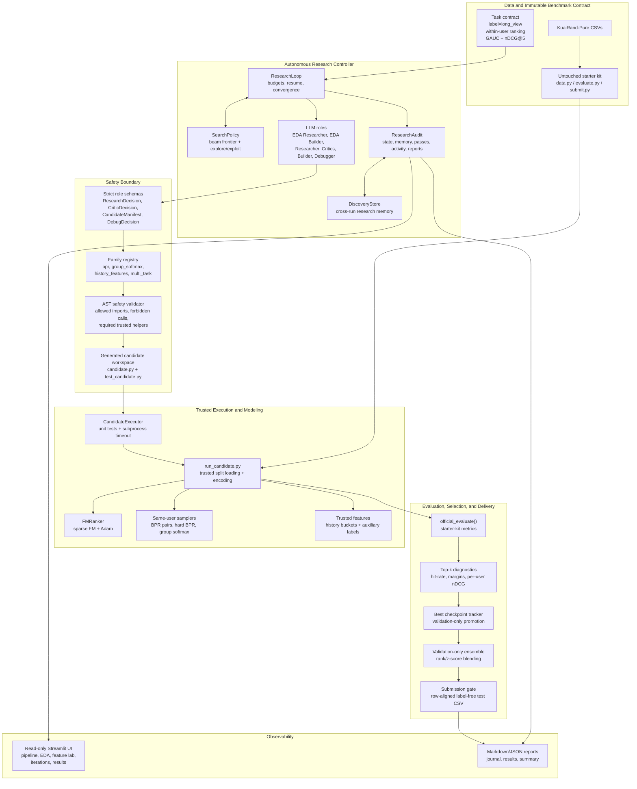

# Current System Architecture and Innovations

Generated on 2026-08-31 from the current repository implementation.

Rendered diagram: [`architecture_diagram.png`](architecture_diagram.png) (the same image the
2-minute deck shows). The mermaid source below is the editable form.

## High-Level Architecture



## Project-Level Innovations

These are the main designs that distinguish the system from a single recommender model.

1. Autonomous role loop with trusted control plane

The LLM proposes and writes candidates, but trusted Python owns admissibility, execution, scoring, checkpoint promotion, convergence, and final submission. The roles are separated into EDA, Researcher, Critic preflight/adjudication/postflight, Builder, and Debugger. Every role returns strict JSON and is recorded in the audit ledger.

2. Registry-bounded research families

Research is constrained to approved families with explicit method cards, parameter grids, defaults, and required trusted helper calls. This lets the system be creative inside safe boundaries instead of allowing arbitrary code or arbitrary task definitions.

Current families:

| Family | What it varies | Mandatory trusted helper |
|---|---|---|
| `bpr` | Pairwise same-user ranking loss | `sample_bpr_pairs` |
| `group_softmax` | Listwise positive-vs-K-negatives loss | `sample_softmax_groups` |
| `history_features` | Leakage-safe behavioral feature fields | `build_features` plus a trusted sampler |
| `multi_task` | Auxiliary train-only supervision | `build_aux_labels` plus a trusted sampler |

3. Controller-owned search policy

The controller, not the model, owns parent selection, duplicate avoidance, branch pruning, family coverage, and a deterministic 70/30 explore/exploit allocation. The frontier is ranked by validation evidence, uncertainty, novelty, failure risk, and runtime.

Expected improvement is estimated as:

```text
target = incumbent + max(epsilon, estimated_seed_noise)
z = (mu - target) / sigma
EI = max(0, (mu - target) * Phi(z) + sigma * phi(z))
priority = ((EI + 0.25 * uncertainty + 0.10 * epsilon * novelty)
            * (1 - failure_risk) / expected_cost)
           + ndcg_bonus / expected_cost
```

Meaningful validation improvements queue exact seed replications, so variance evidence is collected automatically before conclusions are trusted.

4. Trusted sparse FM core for generated ranking losses

Generated candidates express only score gradients. The shared `FMRanker` owns sparse field lookup, second-order interactions, Adam, L2, prediction chunking, and checkpoint state.

```text
score(x) = b + sum_i W[x_i]
           + 0.5 * ( ||sum_i V[x_i]||^2 - sum_i ||V[x_i]||^2 )
```

This keeps generated methods comparable to the official FM baseline while avoiding dense one-hot implementations over the full field vocabulary.

5. Same-user BPR aligned to within-user ranking

BPR samples positives and negatives only from the same user, matching the benchmark's ranking surface.

```text
d = score(user, positive) - score(user, negative)
loss_bpr = softplus(-d) = -log(sigmoid(d))
d(loss)/d(d) = sigmoid(d) - 1
```

Hard-negative variants restrict the negative pool to high-scoring same-user negatives, optionally constrained by tab or author-style keys.

6. Same-user group softmax for top-list pressure

The group-softmax family trains one positive against K same-user negatives, closer to the evaluated list than independent pointwise examples.

```text
logits = [s_pos, s_neg_1, ..., s_neg_K] / temperature
loss_group = -log_softmax(logits)[0]
gradient = (softmax(logits) - one_hot(pos)) / temperature
```

7. Leakage-safe behavioral history features

History features are built in trusted code from train rows only. For train rows, the default `prior_days` scheme uses only strictly earlier days; validation and test rows use tables fitted from train.

Smoothed rate features use:

```text
rate(key) = (positives(key) + smoothing * global_train_prior)
            / (count(key) + smoothing)
```

Each enabled group becomes one FM field column with 9 slots: 8 train-quantile buckets plus one unknown slot.

Available groups:

| Group | Signal |
|---|---|
| `user_rate` | User long_view propensity |
| `user_author` | User-author affinity |
| `user_tab` | User-tab affinity |
| `recency` | Days since the user's last long_view, capped at 14 |
| `video_age` | Row date minus upload date |
| `tab_cross` | Tab by duration-bucket prior |

8. Train-only multi-task auxiliary targets

The multi-task family keeps the ranking model and field set fixed, then adds auxiliary supervision from train-date behavior columns only.

```text
loss = ranking_loss
       + aux_weight * mean_t(BCE(aux_head_t, aux_target_t))
```

Available heads are `is_click`, `is_like`, `is_follow`, `is_comment`, `is_forward`, and `play_time`, where `play_time` is `log1p(play_time_ms)` then train min-max scaled.

9. Trusted validation metrics and diagnostics

Candidate-reported metrics are ignored. The worker validates score shapes/finiteness, computes official metrics, and adds top-k diagnostics.

Official metric contract:

```text
GAUC = sum_u positives_u * AUC_u / sum_u positives_u
nDCG@5_u = DCG@5_u / IDCG@5_u, or 0 for zero-positive users
Primary = (GAUC + nDCG@5) / 2
```

Per-user AUC uses Mann-Whitney U with tie correction:

```text
AUC_u = (sum_ranks_positive - n_pos * (n_pos + 1) / 2)
        / (n_pos * n_neg)
```

10. Validation-only rank/score ensemble

After convergence, successful candidates with persisted validation and test scores are selected across diverse families. The ensemble searches non-negative simplex weights on validation only, trying both fractional-rank and z-score transforms:

```text
blend(row) = sum_m w_m * transform_m(score_m(row))
sum_m w_m = 1, w_m >= 0
```

The ensemble is accepted only if validation primary strictly beats the single best checkpoint.

11. Submission gate that never exposes hidden labels

The gate writes exactly `row_id,user_id,video_id,score`, validates row count, ID alignment, and finite scores through the starter kit's `submit.py --check`, and records `scored=false`. It does not compute hidden-test metrics.

12. Read-only observability UI

The Streamlit dashboard reads persisted artifacts under `runs/` and aggregate EDA under `artifacts/ui/`. It surfaces live stage, agent notes, candidate diffs, diagnostics, iterations, and results, while rejecting judge-owned paths and not controlling the run.

## Latest Verified Run Snapshot

Designated final run: `20260831T141845874517Z_research`, committed at `runs/final/`.

| Result | GAUC | nDCG@5 | Primary |
|---|---:|---:|---:|
| Best single checkpoint | 0.6707 | 0.5382 | 0.6045 |
| Validation-only ensemble | 0.6711 | 0.5383 | 0.6047 |

The run stopped at iteration 6 by the official convergence rule, used 8 training attempts, reported 446,210 LLM tokens, took 1,771.62 seconds wall-clock, had 0 manual interventions and 0 failed iterations, and passed the label-free submission gate on 170,588 test rows.

Convergence rule implemented by the harness:

```text
converged if any prefix length k > patience satisfies:
max(scores[:k]) - max(scores[:k - patience]) <= epsilon

epsilon = 0.002
patience = 3
```

## Source Map

| Area | Files |
|---|---|
| Controller and stop logic | `src/agent/research_controller.py`, `src/agent/policy.py`, `src/agent/convergence.py` |
| LLM roles and prompts | `src/agent/roles.py`, `src/agent/llm.py`, `research/skills/*.md` |
| Family registry and method cards | `src/agent/families.py`, `research/methods/*.md` |
| Safety and generated workspace | `src/agent/safety.py`, `src/agent/candidate_runner.py` |
| Trusted candidate runtime | `src/experiments/run_candidate.py`, `src/experiments/contracts.py` |
| Model and feature primitives | `src/models/fm_core.py`, `src/models/sampling.py`, `src/models/features.py`, `src/models/ensemble.py` |
| Official metrics and gate | `src/evaluation/official.py`, `src/evaluation/gate.py`, `kuairand-starter-kit/evaluate.py` |
| Audit, reports, UI | `src/agent/audit.py`, `src/agent/report.py`, `src/ui/app.py`, `src/ui/loaders.py` |
